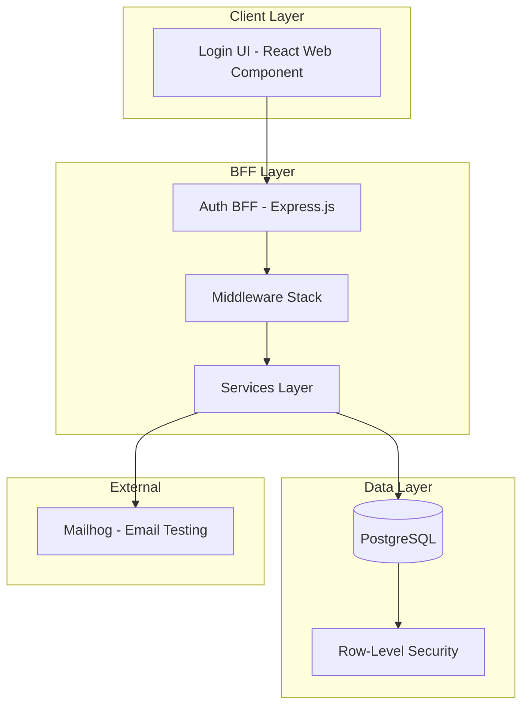

# SaaS Auth Project - Implementation Summary & Manual Testing Guide

## Project Overview

This is a **SaaS Multi-Tenant Login Component** - a cloud-native authentication system designed for deployment on Google Cloud Platform (GCP). The project implements a complete authentication solution with tenant isolation, modern security practices, and a Backend-For-Frontend (BFF) architecture.

---

## What Has Been Implemented

### Phase 1: Database & Migrations ✅ COMPLETE

#### Database Schema ([`schema.prisma`](saas-auth/packages/auth-bff/prisma/schema.prisma))

| Table | Purpose |
|-------|---------|
| `tenants` | Company/organization records with slug-based routing |
| `users` | User accounts with tenant-scoped uniqueness |
| `refresh_tokens` | Long-lived session tokens with rotation support |
| `auth_events` | Immutable audit trail for all auth events |
| `password_history` | Last N password hashes to prevent reuse |
| `password_reset_tokens` | Short-lived tokens for password reset flow |

#### Row-Level Security (RLS)
- Tenant isolation at database level
- Users can only access data within their tenant

#### Seed Data ([`seed.ts`](saas-auth/packages/auth-bff/prisma/seed.ts))
- 2 test tenants (Acme Corp, Beta Org)
- 7 test user accounts
- Platform operator account

---

### Phase 2: Auth BFF Service ✅ CORE COMPLETE

#### Services Layer

| Service | File | Features |
|---------|------|----------|
| **Password Service** | [`password.service.ts`](saas-auth/packages/auth-bff/src/services/password.service.ts) | Argon2id hashing (64MB memory, 3 iterations, 4 threads), password policy validation, password history checking |
| **Token Service** | [`token.service.ts`](saas-auth/packages/auth-bff/src/services/token.service.ts) | RS256 JWT signing, refresh token rotation, JWKS endpoint support, token revocation |
| **Audit Service** | [`audit.service.ts`](saas-auth/packages/auth-bff/src/services/audit.service.ts) | Complete audit logging for all auth events |

#### Middleware Layer

| Middleware | File | Purpose |
|------------|------|---------|
| **Tenant Resolver** | [`tenant.middleware.ts`](saas-auth/packages/auth-bff/src/middleware/tenant.middleware.ts) | Resolves tenant from `X-Tenant-Slug` header or request body |
| **Authentication** | [`auth.middleware.ts`](saas-auth/packages/auth-bff/src/middleware/auth.middleware.ts) | JWT validation, user context injection |
| **Rate Limiting** | [`ratelimit.middleware.ts`](saas-auth/packages/auth-bff/src/middleware/ratelimit.middleware.ts) | Per-endpoint rate limits, brute-force protection |

#### API Routes ([`auth.routes.ts`](saas-auth/packages/auth-bff/src/routes/auth.routes.ts))

| Endpoint | Method | Status | Description |
|----------|--------|--------|-------------|
| `/auth/login` | POST | ✅ | User authentication with account lockout |
| `/auth/logout` | POST | ✅ | Session termination |
| `/auth/refresh` | POST | ✅ | Access token refresh with rotation |
| `/auth/forgot-password` | POST | ✅ | Password reset request |
| `/auth/reset-password` | POST | ✅ | Password reset completion |
| `/auth/me` | GET | ✅ | Current user profile |
| `/.well-known/jwks.json` | GET | ✅ | JWT public keys (JWKS) |

---

### Security Features Implemented

| Feature | Implementation |
|---------|----------------|
| **Password Hashing** | Argon2id (OWASP recommended) |
| **JWT Algorithm** | RS256 with rotating keys |
| **Token TTL** | Access: 15 min, Refresh: 7 days |
| **Account Lockout** | 5 failed attempts → 15 min lockout |
| **Rate Limiting** | Per-endpoint limits |
| **Cookie Security** | HttpOnly, Secure, SameSite=Strict |
| **CORS** | Configurable allowed origins |
| **Helmet** | Comprehensive HTTP security headers |

---

## Architecture Diagram



---

## Manual Testing Guide

### Prerequisites

1. Docker Desktop running
2. Node.js 20+
3. Terminal in `saas-auth` directory

### Step 1: Start Infrastructure

```bash
cd saas-auth
npm run docker:up
```

Wait for PostgreSQL and Mailhog to be healthy:
```bash
docker compose ps
```

### Step 2: Run Database Migrations

```bash
cd packages/auth-bff
npx prisma migrate dev
npx prisma db seed
cd ../..
```

### Step 3: Start the Auth BFF Server

```bash
npm run dev
```

The server should start on `http://localhost:3001`

---

### Test Accounts

| Account Type | Email | Password | Tenant Slug |
|--------------|-------|----------|-------------|
| Platform Operator | operator@yoursaas.com | Operator@Secure123! | system |
| Tenant Admin (Acme) | admin@acme.com | Admin@Acme123! | acme-corp |
| Tenant User (Acme) | alice@acme.com | User@Acme123! | acme-corp |
| Tenant User (Acme) | bob@acme.com | User@Acme123! | acme-corp |
| Disabled User | disabled@acme.com | User@Acme123! | acme-corp |
| Tenant Admin (Beta) | admin@betaorg.com | Admin@Beta123! | beta-org |
| Tenant User (Beta) | carol@betaorg.com | User@Beta123! | beta-org |

---

### API Testing Commands

#### 1. Health Check

```bash
curl http://localhost:3001/health
```

**Expected Response:**
```json
{
  "status": "ok",
  "db": "connected",
  "version": "1.0.0",
  "timestamp": "2026-03-09T..."
}
```

---

#### 2. Login - Success

```bash
curl -X POST http://localhost:3001/auth/login \
  -H "Content-Type: application/json" \
  -c cookies.txt \
  -d "{\"email\": \"admin@acme.com\", \"password\": \"Admin@Acme123!\", \"tenant_slug\": \"acme-corp\"}"
```

**Expected Response:**
```json
{
  "access_token": "eyJhbGciOiJSUzI1NiIsInR5cCI6IkpXVCJ9...",
  "token_type": "Bearer",
  "expires_in": 900,
  "user": {
    "id": "...",
    "email": "admin@acme.com",
    "role": "admin",
    "tenant_id": "...",
    "tenant_name": "Acme Corporation"
  }
}
```

---

#### 3. Login - Invalid Credentials

```bash
curl -X POST http://localhost:3001/auth/login \
  -H "Content-Type: application/json" \
  -d "{\"email\": \"admin@acme.com\", \"password\": \"wrongpassword\", \"tenant_slug\": \"acme-corp\"}"
```

**Expected Response:**
```json
{
  "code": "INVALID_CREDENTIALS",
  "message": "Invalid email or password",
  "attempts_remaining": 4
}
```

---

#### 4. Login - Disabled Account

```bash
curl -X POST http://localhost:3001/auth/login \
  -H "Content-Type: application/json" \
  -d "{\"email\": \"disabled@acme.com\", \"password\": \"User@Acme123!\", \"tenant_slug\": \"acme-corp\"}"
```

**Expected Response:**
```json
{
  "code": "ACCOUNT_DISABLED",
  "message": "This account has been disabled"
}
```

---

#### 5. Get Current User (Authenticated)

```bash
curl http://localhost:3001/auth/me \
  -H "Authorization: Bearer YOUR_ACCESS_TOKEN"
```

**Expected Response:**
```json
{
  "id": "...",
  "email": "admin@acme.com",
  "role": "admin",
  "status": "active",
  "tenant": {
    "id": "...",
    "name": "Acme Corporation",
    "slug": "acme-corp"
  },
  "last_login_at": "...",
  "created_at": "..."
}
```

---

#### 6. Refresh Token

```bash
curl -X POST http://localhost:3001/auth/refresh \
  -b cookies.txt \
  -c cookies.txt
```

**Expected Response:**
```json
{
  "access_token": "eyJhbGciOiJSUzI1NiIsInR5cCI6IkpXVCJ9...",
  "token_type": "Bearer",
  "expires_in": 900
}
```

---

#### 7. Forgot Password

```bash
curl -X POST http://localhost:3001/auth/forgot-password \
  -H "Content-Type: application/json" \
  -d "{\"email\": \"admin@acme.com\", \"tenant_slug\": \"acme-corp\"}"
```

**Expected Response (Development Mode):**
```json
{
  "message": "Password reset token generated",
  "reset_token": "..."
}
```

---

#### 8. Reset Password

```bash
curl -X POST http://localhost:3001/auth/reset-password \
  -H "Content-Type: application/json" \
  -d "{\"token\": \"YOUR_RESET_TOKEN\", \"password\": \"NewSecure@Pass123!\"}"
```

**Expected Response:**
```json
{
  "message": "Password has been reset successfully"
}
```

---

#### 9. Logout

```bash
curl -X POST http://localhost:3001/auth/logout \
  -H "Authorization: Bearer YOUR_ACCESS_TOKEN" \
  -b cookies.txt
```

**Expected Response:**
```json
{
  "message": "Logged out successfully"
}
```

---

#### 10. JWKS Endpoint

```bash
curl http://localhost:3001/.well-known/jwks.json
```

**Expected Response:**
```json
{
  "keys": [
    {
      "kty": "RSA",
      "use": "sig",
      "alg": "RS256",
      "kid": "saas-auth-key-1",
      "n": "...",
      "e": "AQAB"
    }
  ]
}
```

---

### Testing Account Lockout

Run 5 failed login attempts to trigger lockout:

```bash
for i in {1..6}; do
  curl -X POST http://localhost:3001/auth/login \
    -H "Content-Type: application/json" \
    -d "{\"email\": \"admin@acme.com\", \"password\": \"wrongpass\", \"tenant_slug\": \"acme-corp\"}"
  echo ""
done
```

After 5 failures, you should see:
```json
{
  "code": "ACCOUNT_LOCKED",
  "message": "Account is temporarily locked. Please try again later.",
  "locked_until": "..."
}
```

---

### Testing Cross-Tenant Isolation

Try logging in with Acme credentials but wrong tenant:

```bash
curl -X POST http://localhost:3001/auth/login \
  -H "Content-Type: application/json" \
  -d "{\"email\": \"admin@acme.com\", \"password\": \"Admin@Acme123!\", \"tenant_slug\": \"beta-org\"}"
```

**Expected Response:**
```json
{
  "code": "INVALID_CREDENTIALS",
  "message": "Invalid email or password"
}
```

---

## Access Points Summary

| Service | URL |
|---------|-----|
| Auth BFF API | http://localhost:3001 |
| Health Check | http://localhost:3001/health |
| JWKS | http://localhost:3001/.well-known/jwks.json |
| Mailhog Web UI | http://localhost:8025 |
| PostgreSQL | localhost:5432 |

---

## Remaining Work

### Phase 2 (Remaining)
- [ ] Admin routes (user management within tenant)
- [ ] Operator routes (tenant management)

### Phase 3
- [ ] Login UI Component (React web component)

### Phase 4
- [ ] Unit tests
- [ ] Integration tests

### Phase 5
- [ ] Dockerfile
- [ ] Terraform modules
- [ ] Cloud Build configuration
- [ ] GCP deployment

---

## File Structure

```
saas-auth/
├── packages/
│   ├── auth-bff/                    # Backend Service
│   │   ├── src/
│   │   │   ├── app.ts               # Express app setup
│   │   │   ├── index.ts             # Entry point
│   │   │   ├── config/index.ts      # Configuration loader
│   │   │   ├── db/prisma.ts         # Prisma client
│   │   │   ├── middleware/
│   │   │   │   ├── auth.middleware.ts
│   │   │   │   ├── ratelimit.middleware.ts
│   │   │   │   └── tenant.middleware.ts
│   │   │   ├── routes/
│   │   │   │   ├── auth.routes.ts
│   │   │   │   └── jwks.routes.ts
│   │   │   └── services/
│   │   │       ├── audit.service.ts
│   │   │       ├── password.service.ts
│   │   │       └── token.service.ts
│   │   └── prisma/
│   │       ├── schema.prisma
│   │       ├── seed.ts
│   │       └── migrations/
│   └── login-ui/                    # Frontend (not yet implemented)
├── keys/
│   ├── private.pem                  # RSA private key
│   └── public.pem                   # RSA public key
├── scripts/
│   └── generate-keys.ts
├── docker-compose.yml
├── .env
├── .env.example
├── package.json
├── README.md
├── implementation.md
├── task.md
└── CHECKPOINT_01.md
```

---

**Jai Jagannath!**
